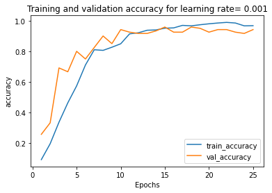
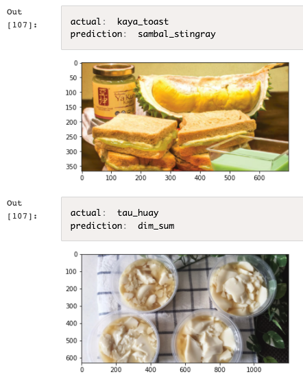

# Tensorfood App
A simple web application that aims to read a food image and accurately predict its food category (among 12 different Singaporean food).

# Introduction
The goal of the project is to predict if a picture is one of 12 Singaporean food: 🦀chilli crab, 🥟curry puff, 🍤dim sum, 🍧ice kacang, 🥪kaya toast, 🍚nasi ayam, 🌯popiah, 🥞roti prata, 🐠sambal stingray, 🍢satay, 🍵tau huay or 🍜wanton noodle. 

A CNN model was built using the `tensorflow.keras` framework and making use of an existing pre-trained network and transfer learning. 

# Instruction


Above is the `home.html` landing page. A user can choose to upload his/her own food picture and click the "Upload" button. 


Above is the `prediction.html` page, which will then display the predicted food label, and the prediction probability. 

There is also `info.html` and `data.html` which the user can explore to learn more about the project. 

Note: The web app only allows `.png`, `.jpeg` and `jpg` file formats.

Disclaimer: Apologies for the overly simple web GUI as it was a quick-and-dirty app built and focus mainly on functionality and productionization. 

# Technology and Resources
Python version: 3.6
Packages: pandas, numpy, tensorflow, flask, pytest, polyaxon (for experiments and hosting of trained model), docker (for clean and friendly productionization)

# File Structure
```
.
├── Dockerfile
├── README.md
├── ci
│   └── myapp
│       ├── Chart.yaml
│       ├── templates
│       └── values.yaml
├── conda.yml
├── env.sh
├── skaffold.yaml
├── src
│   ├── app.py
│   ├── inference.py
│   └── templates
│       ├── data.html
│       ├── home.html
│       ├── info.html
│       └── predict.html
└── tests
    └── test_inference.py
```

Brief desc:
`/src` :  contains python codes to run app
`/src/templates` : contains html files for web browser
`/tests` : test codes under pytest package
`/ci` : required for AISG's CI/CD pipeline

# Model
## Transfer Learning
Different structures of CNN models were experimented to determine the one that produces the optimal accuracy. Eventually, the base model finalised was **MobileNetV2**. Several fully-connected layers and dropouts were also implemented on top of the pre-trained model.

## Architecture
Below is the full architecture of the model:

```Model: "sequential_1"
_________________________________________________________________
Layer (type)                 Output Shape              Param #   
_________________________________________________________________
mobilenetv2_1.00_224 (Functi (None, 7, 7, 1280)        2257984   
_________________________________________________________________
global_average_pooling2d_1 ( (None, 1280)              0         
_________________________________________________________________
dense_1 (Dense)              (None, 500)               640500    
_________________________________________________________________
dropout_2 (Dropout)          (None, 500)               0         
_________________________________________________________________
dense_2 (Dense)              (None, 250)               125250    
_________________________________________________________________
dropout_3 (Dropout)          (None, 250)               0         
_________________________________________________________________
dense_3 (Dense)              (None, 125)               31375     
_________________________________________________________________
dropout_4 (Dropout)          (None, 125)               0         
_________________________________________________________________
dense_4 (Dense)              (None, 12)                1512      
_________________________________________________________________
Total params: 3,056,621
Trainable params: 798,637
Non-trainable params: 2,257,984
_________________________________________________________________
```


# Data
This project explored a dataset consisting of 12 classes of Singaporean food, with about 100 images in each class.

## Train, Test, Val
- 80% (975) was used as training set
- 10% (120) was used as validation set
- 10% (129) was used as unseen testing set

Below is a class distribution of training dataset


Download the 280mb dataset [here](https://aiapstorage1.blob.core.windows.net/datasets/tensorfood.tar.gz.)


## Data Preprocessing
Preprocessing was done on the images via `ImageDataGenerator` before feeding into model training and predictions. 
- `rescale = 1./255`
- `shear_range = 0.2`
- `zoom_range = 0.2`
- `horizontal_flip = True`

# Performance
## Train Performance
Model training was done on 100 epochs, with early callback implemented on `monitor=val_accuracy` and `patience=10`. The model eventually stopped training after 25 epochs.

Below shows the training/validation accuracy:




## Test Performance
Test accuracy stands at **0.95**, with **6/129** wrong predictions. 

Below is a confusion matrix on test dataset results, showing 6 wrong predictions:


Below provides more details on the missed predictions:





# Productionization and Deployment
Flask is used in this project to create a quick web-based application for users to interface with the model. 

The web app is then dockerized into an docker image, and the docker container is mounted and now running on AISG's registry.

## CI/CD
CI/CD is a method to frequently push upgrades/modifications/changes to production environment by introducing automation into the stages of app development.
The main concepts attributed to CI/CD are continuous integration, continuous delivery and continuous deployment.

Successful **continuous integration** means new code changes to an app are regularly built, tested, and merged to a shared repository. It’s a solution to the problem of having too many branches of an app in development at once that might conflict with each other.

**Continuous deployment** (or sometimes known as **continuous delivery** and used interchangeably) means that any changes made by the developer are automatically tested, bug-free, approved by QA and signed off, and push to production repository and ready for live production deployment.

Traditionally, a production deployment could only take place during off-peak hours or weekends. With good CI/CD in-placed, it now takes minimal effort to deploy new code.


## Docker, Image, Container
The "Build once, Run anywhere" mantra.
By using dockers, we are able to reproduce the environment required for the web app to run in the same manner, and in multiple environemnts (eg. local, production, QA).

A docker image is a akin a template, or a set of instructions which tells the container how it should be created. A docker image can also be thought of as a class definition, while a container is an isntance of that class. Once a class definition (a docker image) is defined, we can create many instances of that class (spins out many docker containers).

When a docker image runs, it creates a docker container. 
The container used in this project helps us to package an application with all of the parts it needs, such as libraries and dependencies, and deploy it as one package.

To build the docker file locally 
```docker build . -t tensorfood```

To run docker
```docker run -it -d tensorfood```

To see if container is running fine
```docker ps```


# Future Works
1. To improve on current test cases for more robustness and proper testing
2. To improve on web app's UI/UX 
3. To experiment with different other model architectures
4. To scale and train model with more than 12 classes of Singapore food

# References
https://www.edureka.co/blog/docker-commands/

https://pythonbasics.org/what-is-flask-python/

https://www.redhat.com/en/topics/devops/what-is-ci-cd/


# Credits
Deon, Andy, Kah Ghi, Wei Ming, Yu Yang, David, and all who have helped and guided me through this assignment 🍔
